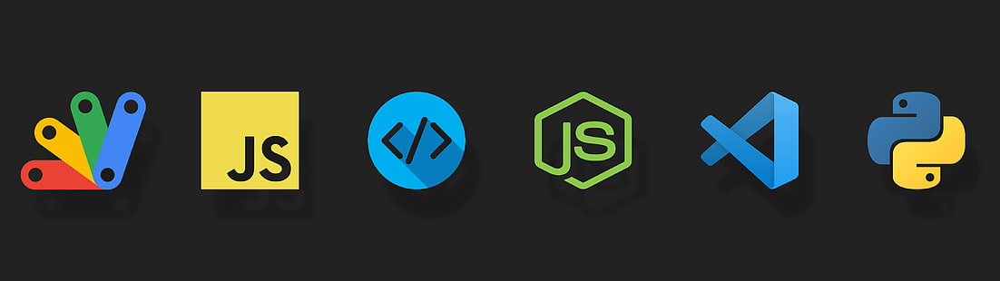

<h6 align="left">Languages And Tools</h6> 

  
  
  
  
  
  
  
  
  
  
  
  
  

---

<h6 align="left"> Connect With Me</h6>

  
  
  
  

---
<h6 align="left"> GitHub Stats </h6>

  
   
  
  

---

<h6 align="left">  Achievements</h6>

  

---

  

